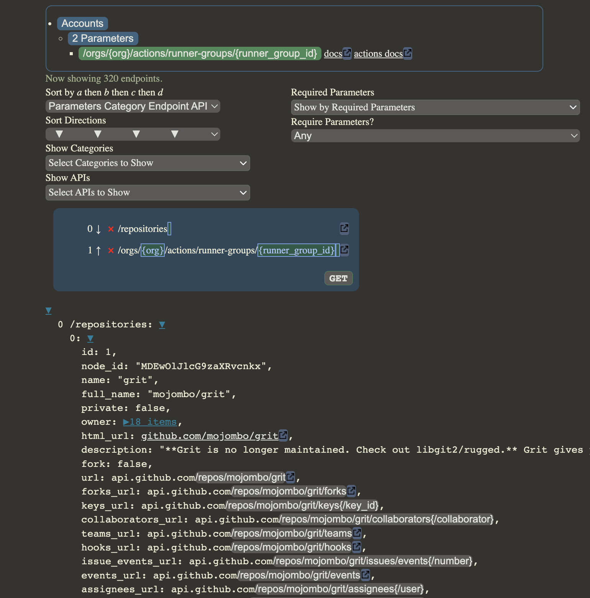

# GetHub

Flexible and easy web-based tool for querying GitHub REST API (GET) endpoints.



## Installation


Download or clone the repo and, from the project's root directory, run:

```sh
npm install
```

## Usage


This app is a single web page meant to be served locally to a browser (working best in Google Chrome) and then used via the page's graphical interface and/or from the browser's console where certain functions, classes and data are exposed globally.  

Run the server:

```sh
npm run dev
```

